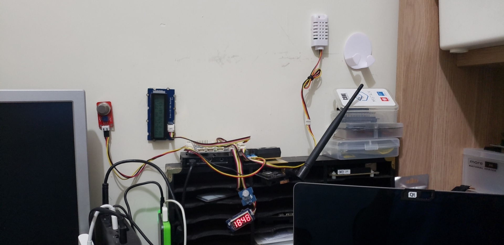
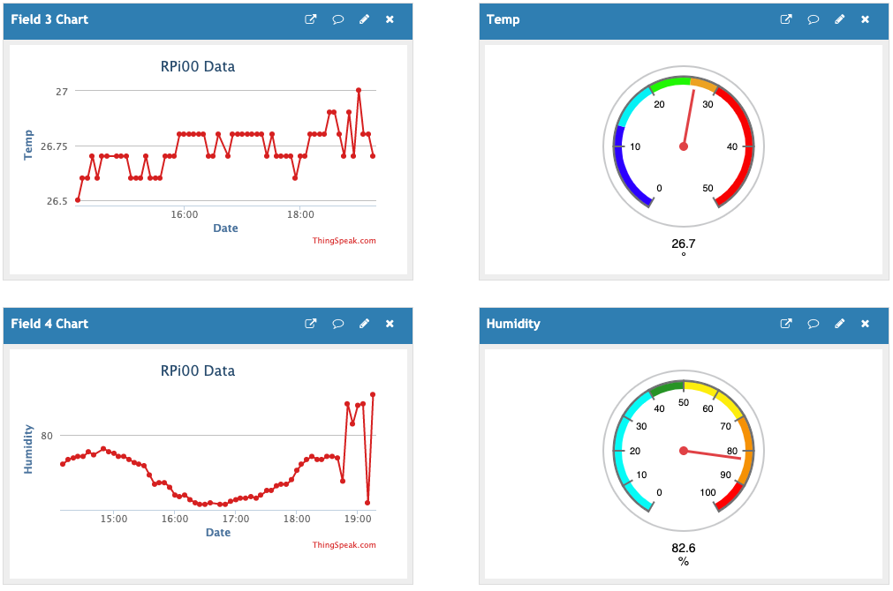
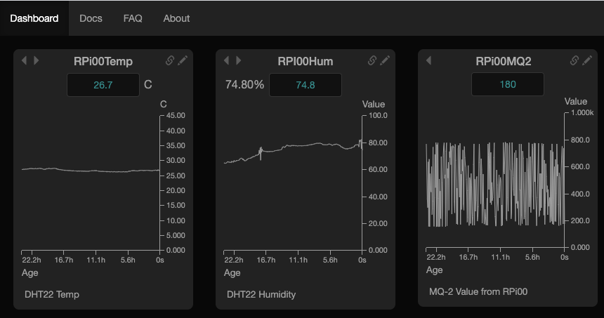
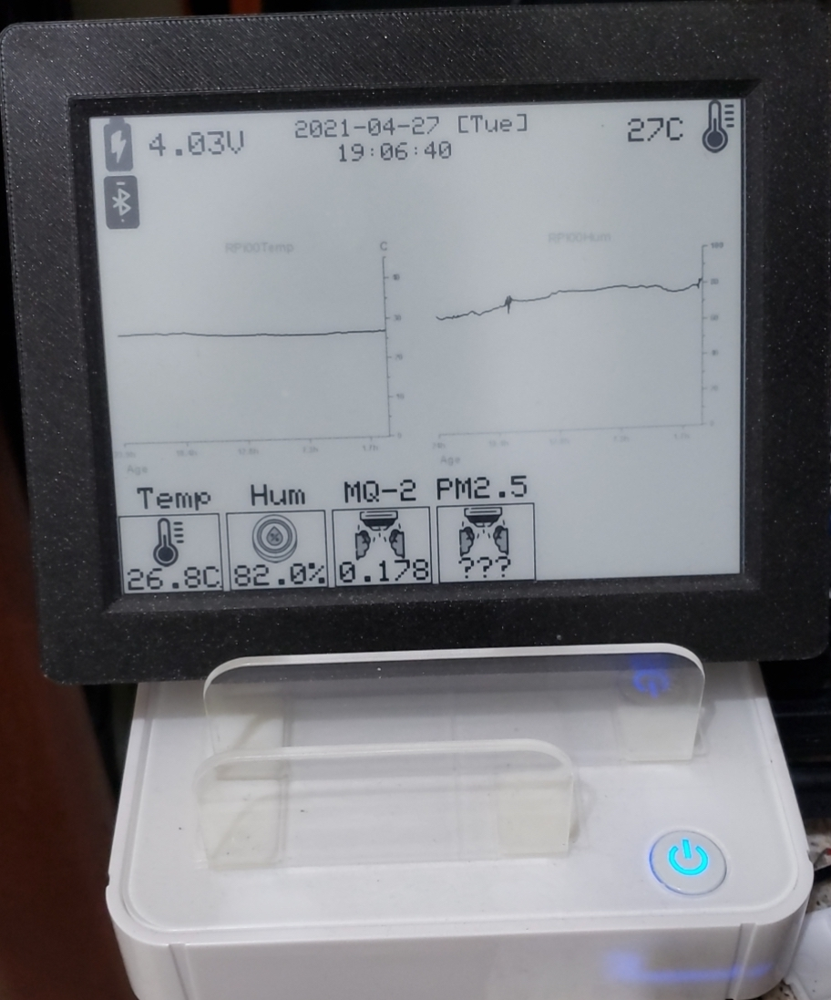

# ENV-GrovePi

This project is a copy of the environment station code I have running on a RPi 3B+ equipped with a [Dexter Industries GrovePi](https://www.dexterindustries.com/grovepi/).


It comes with libraries for SeeedStudio modules that enable to read from sensors and write to actuators. It abstracts quite a bit of code, and makes coding something like a weather / environment station easy. For instance, reading from a DHT sensor connected on pinf D5 is a one-liner:

```python
from grovepi import *

[...]

[temp, hum] = dht(5, 1)
```

I have a DTH22, an MQ2 gas sensor, a Shinyei PPD42NJ Particle Sensor Unit connected to it, along with 2 screens of sorts, a Grove LCD to display the latest data, and a seven-segment for a clock that runs as a separate process in my crontab. Finally, and RGB LED is used when I need to display an alert – part of the `clock.py` process that can serve as a reminder/alarm clock/timer. The code for this part is not shown here.



*Never mind the mess*

The data is collated every 5 minutes, and uploaded to 2 different services, mostly because I can :-) and because I wanted to test different solutions. The first service is [Varipass](https://varipass.org/), and the second [ThingSpeak](https://thingspeak.com/). The latter has a beautiful GUI, and many widgets, which is cool.



Whereas Varipass is very easy to setup and run. It also produces graphs that are perfect for eInk, which was perfect for my use case: I have an [e-radionica Inkplate 6](https://e-radionica.com/en/inkplate-6.html) that picks up the data from Varipass and displays it on the eInk screen.





